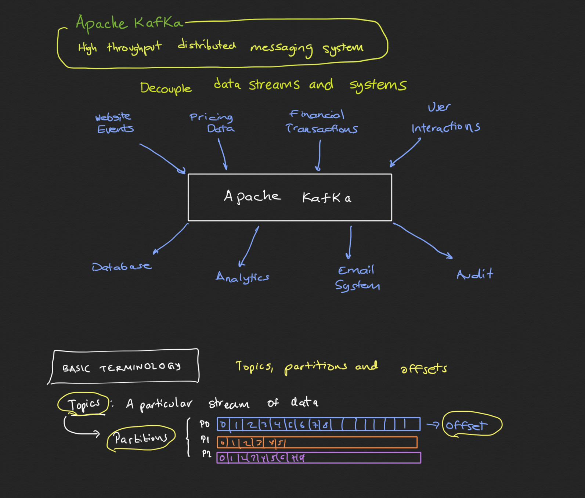

# kafka
Snippets and notes related to Apache Kafka





**Launch Zookeeper**
```
zookeeper-server-start config/zookeeper.properties
```
**Launch Kafka server**
```
kafka-server-start config/server.properties
```

**topics**

```
kafka-topics --zookeeper 127.0.0.1:2181 --topic soccer --create --partitions 3 --replication-factor 1
kafka-topics --zookeeper 127.0.0.1:2181 --list
```

**producers**
```
kafka-console-producer --broker-list 127.0.0.1:9092 --topic soccer
```


**consumers**
```
kafka-console-consumer --bootstrap-server 127.0.0.1:9092 --topic soccer
```

**UI Tool **
[Kafka Tool](https://www.kafkatool.com/)
